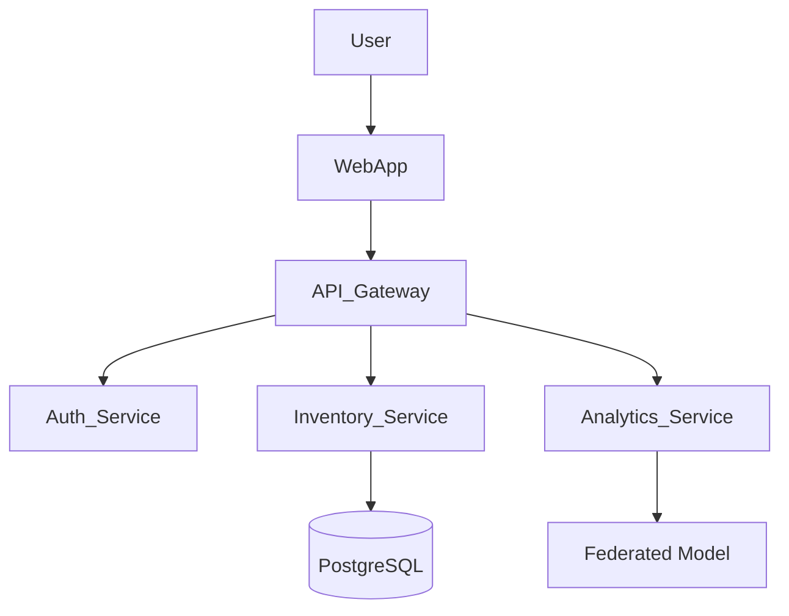

# Architecture Document

## Overview
PHC-Connect Enterprise is designed as a scalable microservices-based system to handle real-time inventory management and epidemiological surveillance.

## Component Diagram

## Data Flow
Data is entered at the PHC level via the Next.js client, processed by the FastAPI backend, and stored in a central relational database. ML analytics run in the background.

## Deployment Architecture
Deployed on scalable cloud infrastructure with containerized (Docker) microservices orchestrated by Kubernetes.
