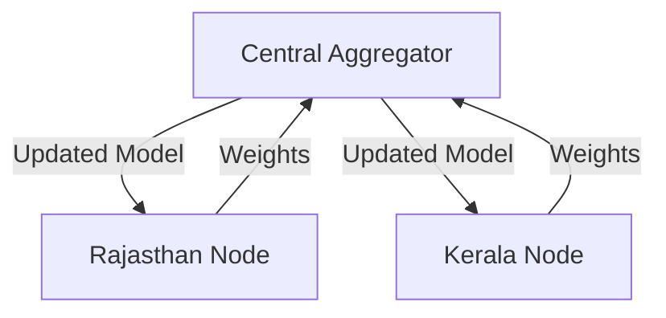

# Federated Learning Approach

## Why Federated Learning?
Healthcare data is highly sensitive. Federated learning allows us to train epidemiological prediction models across multiple state nodes without centralizing patient-level data.

## Architecture
1. **State Nodes**: Each state maintains a local model trained on its IDSP surveillance data.
2. **Central Aggregator**: A central server aggregates model weights (not data) to create a robust national predictive model.

## Privacy Preservation
All local data remains on-premise. Differential privacy techniques are applied to model updates to prevent data leakage.
